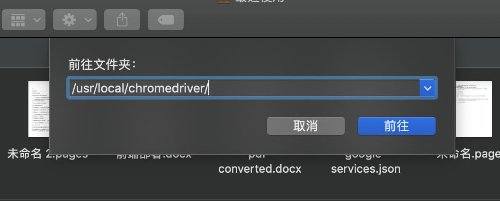

# 第一章 开发环境配置

## 安装和验证 python3 pip3

这里只介绍mac环境下，推荐使用HomeBrew 安装

```text
brew install python3
brew install pip3
```


### 查看python安装路径以及pip安装的包

window下命令

```text
where python
```

linux下命令

```text
whereis python
```

查看pip安装了多少包

```text
pip list
```

如果电脑有两个python,一个python2，一个python3，使用上面的命令查看的是python3中pip安装的包。要查看python2pip安装的包，如下：

```text
python2 -m pip list
```

同理要查看python3 的pip安装的包，则如下：

```text
python3 -m pip list
```

上面可能有的人会出现“python2/python3不是内部或外部命令也不是可运行程序”，那是因为没有自行设置环境变量导致的。所以要实现上面将python2和python3的pip分开的办法是先设置环境变量

## 请求库的安装

爬虫可以分为：抓取页面、分析页面、存储数据

在抓取页面的过程中，我们需要模拟浏览器想服务器发出请求，所以需要用到requests、selenium、aiohttp等第三方库来实现HTTP请求操作。

```text
pip3 install requests
pip3 install selenium
pip3 install aiohttp
```

#### 测试安装是否成功

为了验证库是否成功安装，可以命令行工具输入python3进入代码编辑模式


从图可以看出aiohttp没有安装，代码编辑模式中需要输入exit\(\)退出


#### Chromedriver的安装

selenium是一个自动化测试工具，需要浏览器来配合使用。我们这里只讨论Chrome。Chrome软件更新后，Chromedriver不一定同步更新，所以这里需要注意一下。

查看Chrome的版本号为76


输入Chromedriver查看版本信息


明显和浏览器版本号不一致，这是由于chrome自动更新导致和自己Mac中的老版本chromedriver的对应不上了，所以需要升级chromedriver的版本。

### 升级chromedriver的版本

方法如下： 

1.shell中查看自己的chromedriver版本是否是最新版，shell中输入命令：chromedriver -v

 2.到chromedriver官网下载对应版本的chromedriver驱动：[https://sites.google.com/a/chromium.org/chromedriver/download](https://sites.google.com/a/chromium.org/chromedriver/downloads)

注意下载的文件不能够直接安装，而是需要替换，这里引出一个问题，就是安装可执行文件

#### 打不开“XXX”，因为它来自身份不明的开发者

下载解压，双击运行，mac提示不能安装来自未知程序。需要将可执行文件配置到环境变量或将文件移动到属于环境变量的目录里。或者允许安装未知来源。

#### 允许安装未知来源

（1）打开了 Terminal 终端后 ，在命令提示后输入

> sudo spctl --master-disable

（2）系统偏好设置&gt;&gt;安全与隐私&gt;&gt;允许安装未知来源


3.找到自己的chromedriver安装位置，一般在/usr/local/bin（或者在/usr/bin）下，将新下载的chromedriver替换老版本的chromedriver 4.shell中输入命令：chromedriver -v，查看版本是否更新或者升级成功 。


#### 打开/usr/等文件夹

Mac下/usr/local目录默认是对于Finder是隐藏，如果需要到/usr/local下去，打开Finder，然后使用command+shift+G，在弹出的目录中填写/usr/local就可以了。



替换文件之后，查看版本，发现已经更新


#### 验证selenium是否可以正常使用

进入Python代码编辑模式，输入以下命令，打开一个白板的浏览器，，证明配置没有问题。如果闪退则需要按照前面的步骤检查。

```text
$ python3
>>> from selenium import webdriver
>>> browser =webdriver.Chrome()
```


#### 一个很奇怪的问题

前面我们使用pip3安装了aiohttp，但是在此引用验证却仍然报错。需要pip安装才不会报错。


原因是我的 anaconda3安装了两个python3，pip指的是当前版本3.7，而我的pip3指的是python3版本。所以无效。


另外，官方还推荐安装字符编码检测库cchardet,DNS加速解析库aiodns

```text
pip install cchardet aiodns
```


### 解析库的安装


